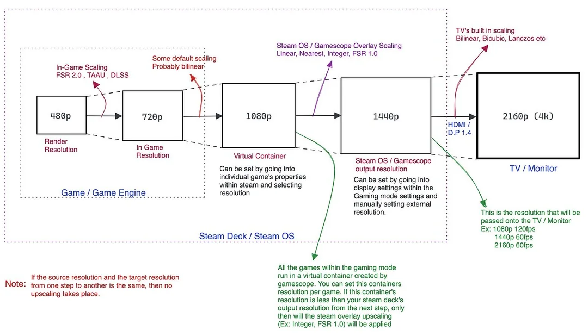

# Legion Go Tricks

This document serves to provide information, workarounds, and tricks to improving day-to-day use of Linux on the Legion Go.

Note that while a lot of things are working, Linux support for this device is very much a work in progress, developers are working on improving the experience.

- [Current Status of Linux on the LGO](#current-status-of-linux-on-the-lenovo-legion-go)
- [What Works?](#what-works)
- [What has Workarounds?](#what-has-workarounds)
- [What has issues?](#what-has-issues)
- [Known Bugs](#known-bugs)
- [User Reported Bugs (needs verification)](#user-reported-bugs-needs-verification)
- [Which Linux Distro Should I install?](#which-linux-distro-should-i-install)
- [Resources](#resources)
- [CSS Loader Themes](#css-loader-plugin---themes)
- [Tutorial Videos](#tutorial-videos)
- [Guides + Small Fixes](#guides--small-fixes)
  - [NobaraOS](#nobaraos-guides)
  - [Bazzite Deck Edition](#bazzite-deck-edition-guides)
  - [Other Guides](#other-guides)
- [Emulator Info](#emulator-info)
- [TDP Control overview](#tdp-control)
- [Controller Support overview](#controller-support)
- [Quality of Life Fixes overview](#quality-of-life-fixes)
- [Resolved/won't fix bugs](#resolved-or-wont-fix-bugs-changelog-for-documentation-purposes)
- [3D prints](#3d-prints)

# Current Status of Linux on the Lenovo Legion Go

ChimeraOS 45 stable, Nobara Deck Edition, and Bazzite Deck Edition, all have a bunch of fixes for the LGO. It's mostly working, but still has bugs that need to be addressed.

However, that being said, Linux is good enough to be a daily driver on the Legion Go.

- Using a PS5 Dualsense Edge Controller Emulator, you get access to the entire LGO controller (including gyro) via steam input
  - the entire controller works detached too
    - however gyro hardware is in the main body with the screen, so it won't really work detached
- TDP control can be done either via Decky Plugin or steam-patch
- RGB control works via Decky Plugin or Steam Input + Dualsense emulation
- suspend-resume works
- all standard hardware (wifi, bluetooth, sound, etc) works

Some of the things you find in this document may be unofficial changes to original software

Read further below for more details

## What Works?

At the moment, the following functions work out of the box

- Screen orientation (fixed in NobaraOS Deck Edition, ChimeraOS 45 stable, Bazzite OS)
- suspend-resume functionality
  - suspend quirk: sound often is fuzzy on resume, usually clears up after 30 seconds or so.
    - sometimes using the [Pause Games plugin](https://github.com/popsUlfr/SDH-PauseGames) with `Pause on Suspend` enabled can help with this issue
- Wifi and Bluetooth
- Sound
- Controllers, both attached and detached
  - note, controllers work best in X-input mode. see [official Legion Go Userguide PDF](./legion_go_user_guide_en.pdf) to read more about controller modes
  - ChimeraOS, NobaraOS, BazziteOS all ship OOTB with basic controller support
  - some non-gaming distros don't include the udev rule for the controller, you can manually add it with [this script](./add-lgo-xpad-rule.sh)
  - BazziteOS + NobaraOS ships with HHD, which enables full gyro + back button support in steam input 
- FPS/Mouse mode
- scroll wheel on controller works fine for scrolling websites, etc
  - scroll wheel press doesn't do anything in game mode, registers as a scroll wheel click in desktop mode
  - holding the scroll wheel for 5s will toggle the scroll wheel on/off
- trackpad works, but cannot tap-to-click in game mode.
  - Can tap to click on desktop mode, but must be enabled in the touchpad settings.
  - Can be used in steam input with a workaround.
- Battery Indicator in Game Mode - requires bios v29

## What Has Workarounds?

These functions are not working out of the box, but have workarounds

- Steam/QAM Buttons/Rear back buttons - all buttons can be used in Steam via Dualsense Edge Virtual/Emulated Controller [Video demo here](https://www.youtube.com/watch?v=uMiXNKES2LM).
  - note that Bazzite and Nobara now ship with hhd, which enables all buttons + gyro to work ootb.
- Gyro - uses the same fix as buttons fix
  - Gyro performance is best with hhd Dualsense Edge Emulator
- Trackpad - this hardware previously already worked, but was not usable in steam input.
  - With the latest version of the PS5 Dualsense edge emulators, it is now usable in steam input. [Video Demo here](https://www.youtube.com/watch?v=RuSboPkZob4)
- TDP - requires using either steam-patch or decky plugins
- Controller RGB Lights - requires decky plugin or HHD (HHD enables steam input RGB support) See [Video Demo here](https://youtu.be/HHubJ8AnkUk?si=oWLVultDKBMVOxlo&t=35)
- GPU Frequency control - via SimpleDeckyTDP plugin or steam-patch
- Custom Fan Curves - via LegionGoRemapper plugin
  - fan curves confirmed to work with bios v29
- Games can sometimes default to 800p, you will need to manually change the resolution per game in the `Steam Settings > Properties > Game Resolution` to either `Native` or other higher resolutions.
- v28 bios - STAMP mode is bugged on both Windows and Linux when setting high TDPs with 3rd party tools like ryzenadj and handheld companion
  - users reported that they were getting hard crashes at 30W TDP on both Windows and Linux
  - **Solution**: on STAMP mode, TDP must be set with a custom fan curve that will prevent thermal shutdown.
    - You can set custom fan curves on bios v29 with the LegionGoRemapper plugin
    - alternatively, if you don't want to use a custom fan curve, you can enable the `Lenovo Custom TDP` toggle in SimpleDeckyTDP
    - steam-patch should similarly work on the LGO
- Screen Refresh Rate and FPS control - unified refresh rate + FPS slider now works perfectly on latest bazzite stable, fixes should now also be on the latest Nobara Deck Edition too.
  - ChimeraOS might not have the fix yet.
- adaptive/auto display brightness doesn't work yet
  - manual brightness slider in steam UI works without issues
  - there's work in progress from devs for to get this fully working

## What has issues

- **v29 bios - IMPORTANT BIOS BUG:** You cannot set custom fan curves and use Lenovo's custom TDP mode for TDP control simultaneously,the LGO bios has a bug
  - this bug is fully resolved on bios v29.1
- Warning: there's some user reports that there's screen flashing on bios v29 with Nobara.
  - this bug has not been reported on Bazzite, unconfirmed on ChimeraOS
- Adaptive Brightness sensor - hardware is detectedby the OS, but not used for auto-brightness yet
  - there's dev work in progress for auto-brightness
    - if you wish to test it out, see [here](https://github.com/corando98/LLG_Dev_scripts?tab=readme-ov-file#ltchipotles-adaptive-brightness-algorithm)

### Known bugs

- Occasionally the steam menus and mangohud performance overlay will flash white
  - mostly likely related to display refresh rate or v29 bios update, but currently there's no known fix
  - this bug may only be present on NobaraOS
    - has not been reported on Bazzite or ChimeraOS
- BazziteOS - after fresh install, sometimes you encounter a blank screen on reboot
  - fix found [here](#blank-screen-on-first-reboot)
- suspend-resume quirk: sound often is fuzzy on resume, usually clears up after 30 seconds or so, but not all the time.
  - sometimes using the [Pause Games plugin](https://github.com/popsUlfr/SDH-PauseGames) with `Pause on Suspend` enabled can help with this issue
- HHD (Dualsense Emulator) - It should now hide the Xbox controller in steam input, and only show the Dualsense Edge.
  - If you see an extra Xbox controller in steam input, you can flip the fps-mode switch on and off for to make it disappear. You can leave the controllers attached when you do this.
  - This should also fix any issues where emulators don't recognize the controller, since the emulator was latching onto the Xbox controller
    - if you still have a controller issue, reorder the controller from player 2 to player 1 in the QAM. sometimes it registers as player 2 even when no other controller is attached
- HHD PS5 Controller Emulator bug
  - If you hold an LGO joystick input while booting or resuming from suspend, the input may get stuck in whatever direction you were pointing
  - workaround: don't press anything for a few seconds, let the device register itself
- user reports say wifi has lower download speeds on Linux vs Windows
- alternative resolutions while in desktop mode are buggy/broken
  - instead of changing resolution, change scaling for to enlarge/shrink UI elements

### Bazzite bugs

- (resolved) Flaky suspend on latest bazzite version
  - this should be fixed in kernel 6.7.5, update to the latest bazzite release for to get the updated kernel.


### Nobara bugs

- make sure to be on the latest nobara for all the bugfixes
- controller is more buggy in desktop mode for desktop-related usage, steam input doesn't work. should still work fine for gaming
  - nested desktop is completely fine
- Warning: there's some user reports that there's screen flashing on bios v29 with Nobara.
  - this bug has not been reported on Bazzite, unconfirmed on ChimeraOS

### User-reported bugs (needs verification)

- microphone might not work on bazzite
  - requires verification
- certain Decky plugins require `deck` as your username
  - deck username fixes Animation changer plugin and mangopeel plugins
- nobaraOS v39
  - game mode global FSR is not working

# Which Linux Distro should I Install?

If you want a SteamOS-like experience, there are 3 distros I would recommend

1. BazziteOS Deck Edition
2. Nobara Deck Edition
3. ChimeraOS

As for which one you should install, here's a breakdown of the benefits and drawbacks of each.

## BazziteOS Deck Edition

**Pros**

- Highly recommended for more casual users who don't want to tinker much
- Has the best out-of-box experience on the Legion Go
  - Tools such as Decky, Emudeck, HHD (for Controller Emulation), etc, are either pre-installed, or have an easy install process
  - Excellent support from the Bazzite Devs and community
    - Bazzite Discord is the place to go to for support and discussion, see [here](https://github.com/ublue-os/bazzite?tab=readme-ov-file#join-the-community)
  - Very quick to fix issues and provide OS updates
- Read-only root filesystem helps with providing better security, more stability, and overall a very good stable console-like experience
  - also has SE Linux configured out of the box
- Can configure Secure Boot, which allows for disk encryption and other security benefits
  - Secure boot requires some additional configuration steps
- Has both a Gnome and KDE Desktop mode option
- supports distrobox for more flexibility in software install options

**Cons**

- Due to it's read-only root OS, it's harder to do more comprehensive tinkering
  - e.g. running a custom Linux kernel, etc
- slow OS install + OS updates, they take a long time

## Nobara Deck Edition

**Pros**

- Recommended for those more familiar with Linux, and don't mind troubleshooting a lot or tinkering
- Nobara is the most similar to a standard Linux distro, and does not have a read-only root filesystem
- This provides the most flexibility for running custom kernels, modifying system files, etc
- Can setup most workarounds and tools for a great experience on the Legion Go
- now ships with HHD and gamescope patches by default, so it should be a fairly bug-free experience now
  - requires latest NobaraOS updates

**Cons**

- Nobara tends to run cutting edge kernels, and makes other frequent changes to the OS
  - This often leads to updates introducing bugs or breaking features on the Legion Go
- Due to no read-only root FS, easier to accidentally mess up your device and put it into a borked state
- Nobara is basically run by one dev, GloriousEggroll (same guy behind GE-Proton), along with a few helpers
  - While GloriousEggroll does excellent work, Nobara is understaffed and it will sometimes be difficult to get help or support if you run into problems
- Only Desktop is KDE, so if you prefer Gnome, you'll have to look elsewhere or manually install + manage it.

## ChimeraOS

**Pros**

- Aims to be a very streamlined console-like experience, doesn't include lots of extra software, etc
  - very minimalist, very stable
- Very easy to pin your device to a stable OS version
  - so once you get a good working setup, you can lock your OS version and then opt to manually update whenever you want
  - great if you want a console like experience where you can "set-it-up-and-forget-it"
- Has a read-only root filesystem, but can also be fully unlocked if necessary
  - note: filesystem unlock does not survive OS updates because it re-locks after an OS update.
- Excellent support for a variety of handhelds besides the Legion Go
- Good Dev and community support on their Discord
- Has it's own implementation of Emulator support, etc
- supports distrobox for more flexibility in software install options

**Cons**

- Installing some recommended tools, such as acpi_call for custom fan curves, requires unlocking the root filesystem
  - ChimeraOS 45-1 will include `acpi_call`
- hhd needs to be manually installed
  - handycon will also need to be manually disabled after every major OS update
- ChimeraOS's emulation implementation interferes with Emudeck, you'll need to manually disable the ChimeraOS implementation
- Only desktop option is Gnome, so anyone that prefers KDE will have to look elsewhere

# Resources

HHD - PS5 Dualsense Edge Emulator - https://github.com/hhd-dev/hhd

- has a Decky plugin available for changing hhd settings: https://github.com/hhd-dev/hhd-decky
- also has a desktop app https://github.com/hhd-dev/hhd-ui

RGB Decky Plugin - https://github.com/aarron-lee/LegionGoRemapper/

Simple Decky TDP Plugin - https://github.com/aarron-lee/SimpleDeckyTDP

LegionGoRefreshRates Decky Plugin - experimental plugin for changing default screen resolution in game mode. https://github.com/aarron-lee/LegionGoRefreshRate

Script that monitors CPU temps and blasts fans when temps are too high - see guide [here](#setup-monitor-script-that-blasts-fans-when-cpu-temps-climb-too-high-tested-on-nobaraos-only)

steam-patch (for TDP control, some steam glyphs, etc) - https://github.com/corando98/steam-patch

reverse engineering docs - https://github.com/antheas/hwinfo/tree/master/devices

rogue-enemy (deprecated, no longer maintained) - PS5 Dualsense Edge Emulator - https://github.com/corando98/ROGueENEMY/

powerbutton fix when using rogue-enemy - https://github.com/aarron-lee/steam-powerbuttond

Pipewire sound EQ improvement files (not maintained) - https://github.com/matte-schwartz/device-quirks/tree/legion-go/rog-ally-audio-fixes/usr/share/device-quirks/scripts/lenovo/legion-go

<!-- (ChimeraOS only) Legion Go installer tool - https://github.com/linuxgamingcentral/legion-go-tools-for-linux -->

gyro increase sampling rate fix (advanced users only, not maintained) - https://github.com/antheas/llg_sfh

## CSS Loader Plugin - Themes

- note, requires `CSS Loader` Decky Plugin
- manually install by downloading the theme + placing in `$HOME/homebrew/themes/` folder
- these themes may require a reboot for them to work

Legion Go Theme - https://github.com/frazse/SBP-Legion-Go-Theme

PS5 to Xbox Controller Glyph Theme - https://github.com/frazse/PS5-to-Xbox-glyphs

- If you'd like to manually edit mappings, you can find glyphs at `$HOME/.local/share/Steam/controller_base/images/api/dark/`
  - manual mapping can be done by editing the css file with the svg/png paths you want

```
# quick install, CSS Loader Decky Plugin must already be installed and enabled

# Legion Go Theme Install
cd $HOME/homebrew/themes && git clone https://github.com/frazse/SBP-Legion-Go-Theme.git

# PS5 to Xbox Controller Glyph Theme
cd $HOME/homebrew/themes && git clone https://github.com/frazse/PS5-to-Xbox-glyphs
```

# Tutorial Videos

Dual Boot Tutorial Video (Bazzite + Windows) : https://www.youtube.com/watch?v=3jFnkcVBI_A

- Partition guide for Dual boot with Bazzite: [see here](/bazzite-dualboot-partition-guide.md)

Dual Boot Tutorial Video (Nobara + Windows): https://www.youtube.com/watch?v=anc7hyPU6Lk

# Guides + small fixes

## NobaraOS Guides

### Fix 60Hz and 144Hz

should now be fixed with the latest NobaraOS updates.

### Setup lock screen for desktop mode only (KDE only)

Currently, Desktop mode does not have a lock screen during suspend-resume cycles on NobaraOS.

To fix this, go into Desktop mode, then configure `Screen Locking` in KDE desktop settings. You can optionally configure it for `after waking from sleep`.

This should show a login screen for suspend/resume in desktop mode only. In game mode, you should still get the expected regular behavior.

### Setup Monitor script that blasts fans when CPU temps climb too high (tested on NobaraOS only)

The Legion Go bios currently has behavior where if temps get too high, it manually forces TDP values to lower values until temps cool off

To mitgate this issue, you can setup a monitoring script that will blast the fans at full speed whenever it sees temps that are too high.

Install Instructions:

1. run `sudo modprobe acpi_call`, and see if this command errors out for you; if it does display an error, you need to install `acpi_call` on your linux distro

If it did not error out for you, we need to enable acpi_call by default so that you don't need to manually run `sudo modprobe acpi_call` on every boot.

You can do so via running the following script: [enable-acpi-call.sh](./enable-acpi-call.sh)

2. Download the files required

```
cd $HOME && git clone https://github.com/corando98/LLG_Dev_scripts.git
```

3. before installing, you can edit the `$HOME/LLG_Dev_scripts/fan-helper_install.sh` script if you'd like to change what temperature will trigger the fan

- in the file, you can replace the `85` in the line with `--temp_high 85 --temp_low 80`

4. run the install script, it will ask for your sudo password

```
cd $HOME/LLG_Dev_scripts && chmod +x ./fan-helper_install.sh && sudo ./fan-helper_install.sh
```

5. To verify that it's working, you can type in the following: `sudo systemctl status legion_fan_helper.service`

The result should look something like this:

```
Jan 03 21:03:19 nobaraLGO systemd[1]: Started legion_fan_helper.service - Legion Go Fan helper method.
Jan 03 21:03:19 nobaraLGO python3[10905]: 2024-01-03 21:03:19,473 - INFO - CPU Temperature: 46°C
Jan 03 21:03:19 nobaraLGO python3[10905]: 2024-01-03 21:03:19,473 - INFO - AC Status: Plugged In
```

6. You can now quit/close the terminal, and reboot

7. If you ever want to uninstall this temperature monitoring script, run the following one line at a time:

```
sudo systemctl disable --now legion_fan_helper.service
sudo rm /etc/systemd/system/legion_fan_helper.service
sudo rm -rf $HOME/LLG_Dev_scripts
```

### Change default boot kernel on Nobara v39

This will let you change your default kernel.

using this command to figure out the kernels you have installed:

```bash
sudo grubby --info=ALL | grep kernel
```

Look for the version number you want to make the default, it should be a number, something like `6.7.0-204`

Then run the following

```bash
sudo grubby --info=ALL | grep -i REPLACE_THIS_WITH_KERNEL_VERSION_NUMBER -B 1 | grep index

# example: if you're looking for 6.6.9-203
sudo grubby --info=ALL | grep -i 6.6.9-203 -B 1 | grep index
```

You should get an index number that shows up after running the command.

After having index number of the kernel you want as the default, run:

```bash
sudo grubby --set-default THIS_INDEX_NUMBER

# example: if the number is 3
sudo grubby --set-default 3
```

Then reboot, and verify it's working:

```bash
# reboot, this should print out your kernel version
uname -r
```

Thanks @cox on discord for the info, and @megabadd for recommending some improvements to the instructions

### Fix display-out not working for a display/monitor that previously worked

`~/.config/gamescope/modes.cfg` contains resolutions for monitors that have been configured.

Sometimes monitor settings in the file are set to erroneous values that the display could not handle.

To fix this, removing the display from the file allows it to be reconfigured. thanks @braymur on discord

### NobaraOS Desktop Mode - automatically set desktop resolution scale

1. Save [this script](./desktopmode-autoscale.sh) somewhere and mark it as executable

- `chmod +x ./desktopmode-autoscale.sh`

2. (optional) edit script's `SCALE=1.5` value to whatever scale you want

3. Add it to your KDE Autostart config (Menu > search for Autostart > Add)

### Use MangoHud for battery indicator

Battery indicator is inconsistent on the Legion go. As a workaround, you can change mangohud to show just the battery on one of the presets.

example preset, file should be in the `$HOME/.config/MangoHud/presets.conf`

```
[preset 1]
battery=1
fps=0
cpu_stats=0
gpu_stats=0
frame_timing=0
```

### Fuzzy screen issue

If you're seeeing a fuzzy screen, it means that the you're somehow using an invalid refresh rate. The only valid refresh rates for a game are 60 and 144Hz.

Update: There's a refresh rate permanent fix available on BazziteOS, the fix should also be on the latest NobaraOS

### Disable nobaraOS grub boot menu during boot

[Source](https://www.reddit.com/r/linux4noobs/comments/wzoiu4/comment/im5cfx7/?context=3)

Note, you should never change the content of `/boot/grub/grub.cfg`

What you probably want to do is to hide grub’s boot menu, you can do it two ways:

- By hiding the boot menu
  - for non-technical users:
    - go to your `/etc/default` folder, then open the `grub` file with kate.
    - Edit the file and add `GRUB_TIMEOUT_STYLE=hidden`, then save. It'll prompt for your password.
    - Afterwards, in terminal run `sudo update-grub`
  - for technical users: `sudo vim /etc/default/grub` and set `GRUB_TIMEOUT_STYLE=hidden`. save changes, then run `sudo update-grub`
- Or by making the boot menu timeout 0, to do that:
  - for non-technical users:
    - go to your `/etc/default` folder, then open the `grub` file with kate.
    - Edit the file and set `GRUB_TIMEOUT=0`, then save. It'll prompt for your password.
    - Afterwards, in terminal run `sudo grub-mkconfig`
  - for technical users:`sudo vim /etc/default/grub` and set `GRUB_TIMEOUT=0`. save changes, then run `sudo grub-mkconfig` to generate `/boot/grub/grub.cfg`

Tip: even if your boot menu is hidden, you can access it when your pc is starting:

If you have BIOS: press and hold SHIFT key right after you see you Motherboard/PC splash screen

If you have UEFI: start pressing ESC the moment you see your motherboard/pc splash screen.

### Updated Nested Desktop with Nobara 39 (thanks matt_schwartz for the update):

`sudo dnf install plasma-lookandfeel-nobara-steamdeck-additions`

includes:

- should support Legion Go at native resolution
  - It should work for both Steam Deck and ROG Ally.
  - Make sure to set the game entry to “Native” in the Steam game settings menu first.
- you’ll have to set scaling once in the KDE settings when the nested desktop session loads for the first time but it should save it for future nested desktop sessions
  or else the screen will be for ants at 1600p
- also adds back the right-click “add to steam” shortcut you get with the steamdeck-KDE-presets package (which conflicts with the new theming)

<!-- Here's a run down on how to get running
```git clone https://github.com/AdnanHodzic/auto-cpufreq.git```
```cd auto-cpufreq && sudo ./auto-cpufreq-installer```
Create this in /etc/auto-cpufreq.conf
```[charger]

governor = shedutil
energy_performance_preference = performance
scaling_min_freq = 1600000
scaling_max_freq = 5100000
turbo = auto

[battery]

governor = powersave
energy_performance_preference = performance
scaling_min_freq = 1600000
scaling_max_freq = 3300000
turbo = auto ```
then ```auto-cpufreq --install``` or if you want to see what's it doing ```auto-cpufreq --live``` -->

## Bazzite Deck Edition Guides

### FAQ on bazzite site for rollback, pinning OS version, etc

See official site at: https://universal-blue.discourse.group/docs?topic=36

### Blank Screen on First Reboot

If you see a frozen or blank screen on first reboot after a fresh installation of Bazzite, you can permanently fix the issue via the following:

1. press `Ctrl + Alt + F2` to open a terminal
2. login via your username and password
3. once logged in, type `steamos-session-select plasma`

- if you are on deck-gnome, try swapping `plasma` with `gnome` if it doesn't work

4. the terminal command should switch you to desktop mode
5. from desktop mode, just press the `Return to Game Mode` shortcut on the Desktop

- for deck-gnome, the `return to game mode` shortcut will be in the menu that you see after you click the top-left corner of the screen

### Nested Desktop Screen is rotated incorrectly

Open terminal in Nested Desktop (NOT Desktop mode), and run the following:

```bash
kscreen-doctor output.1.rotation.normal
```

then restart nested desktop

### Nested Desktop fails to start, or freezes very frequently

User reported issue where Nested Desktop frequently fails. As a fix, set a `per game profile` for Nested Desktop with 60hz as the screen resolution.

If you still run into frequent freezes, please report the bug on the Bazzite Discord.

### Change Nested Desktop Resolution

run the [bazzite-nested-desktop-resolution.sh](./bazzite-nested-desktop-resolution.sh) script.

You can edit the script with your preferred nested desktop resolution before running it.

After running the script, restart Game mode. Then change steam's resolution to match the resolution you set.

### Roll back to Bazzite image with specific Linux Kernel

let's say you want to revert Bazzite to an image with kernel 6.6

First, you can find the list of bazzite-deck images here: https://github.com/ublue-os/bazzite/pkgs/container/bazzite-deck/versions?filters%5Bversion_type%5D=tagged

Look for the version for specific dates, it'll look like `39-YYYYMMDD`

e.g. `39-20240205`

This will let you find the kernel version on that given image

`skopeo inspect docker://ghcr.io/ublue-os/bazzite:39-20240205 | grep ostree.linux`

if the number matches with the kernel version that you want to deploy, you can then deploy the image:

```
rpm-ostree rebase ostree-image-signed:docker://ghcr.io/ublue-os/bazzite-deck:39-20240205
```

### How to figure out your current Bazzite Image

run `rpm-ostree status` in terminal, you'll see info on your current image.

### Change Desktop Steam UI scaling

First, try changing the following (original tip found [here](https://www.reddit.com/r/LegionGo/comments/1as75lf/comment/kqpau3c/?utm_source=share&utm_medium=web3x&utm_name=web3xcss&utm_term=1&utm_content=share_button)):

`System Settings > Display and Monitor > Display Configuration > Legacy Applications: Scaled by the system`

If this doesn't work, then proceed to the next steps.

This is for Bazzite-Deck, not Bazzite-Deck-Gnome

thanks @noobeta on discord for this tip!

For technical users:

run `sudoedit /etc/environment`, and add `STEAM_FORCE_DESKTOPUI_SCALING=2` to the end of the file. save changes, and reboot afterwards.

for non-technical users:

run `xdg-open /etc/environment` in terminal, it will open up the file in a text editor. Add `STEAM_FORCE_DESKTOPUI_SCALING=2` to the end of the file, and save. You will be prompted for your password, save and then reboot.

Note that if you edit the `/etc/environment` file, it will change the scaling of the on screen keyboard in desktop mode.

---

## Other guides

### How to use steam's scaling features, such as int scaling, FSR, etc



Full guide here: https://medium.com/@mohammedwasib/a-guide-to-a-good-docked-gaming-experience-on-the-steam-deck-346e393b657a

Reddit discussion [here](https://www.reddit.com/r/SteamDeck/comments/z90ca0/a_guide_to_a_good_docked_gaming_experience_on_the/)

PDF Mirror of guide [here](./steam-resolutions-guide.pdf)


### Install Refind bootloader for touchscreen option to switch between Windows and Linux

source: [reddit post](https://www.reddit.com/r/LegionGo/comments/1atag1z/comment/kqw3y05/?utm_source=share&utm_medium=web2x&context=3)

Resources:

https://sourceforge.net/projects/refind/

http://www.rodsbooks.com/refind/

Instructions:

1. Enter on Bazzite Desktop mode
2. Download the RPM on SourceForge and open a terminal (ex : Console on Bazzite)
3. cd into your Download directory (ex : `cd ~/Downloads/`)
4. Run `sudo rpm-ostree install refind-*.rpm` (This will install the rEFInd RPM using rpm-ostree)
5. Run `sudo refind-install` (Read further into the ressources if you want to enable Secure Boot)
6. OPTIONAL : Download [custom rEFInd theme](https://drive.google.com/drive/folders/1QJBljL_8QPeaMhQ0-qXAc9U8f3AcgNBs?usp=sharing) (credits goes to Yannis Vierkötter and his rEFInd-Minimalist for the original theme) (download mirror link [here](./resources/rEFInd-Minimalist-LGO_Bazzite.zip))
7. OPTIONAL : Unzip then run `sudo sh -c 'mkdir /boot/efi/EFI/refind/themes/ ; set -euo pipefail cp -r rEFInd-Minimalist-LGO_Bazzite/ /boot/efi/EFI/refind/themes/ && grep -qFx "include themes/rEFInd-Minimalist-LGO_Bazzite/theme.conf" "/boot/efi/EFI/refind/refind.conf" || echo "include themes/rEFInd-Minimalist-LGO_Bazzite/theme.conf" >> /boot/efi/EFI/refind/refind.conf ' ` (make sure rEFInd-Minimalist-LGO_Bazzite/ is present in the directory you are currently in, type in the command `ls` to see all available files)
8. Reboot into BIOS and set rEFInd as the first option in the boot order
9. Bonus step : Set the Bazzite bootsplash in portrait mode, Run `sudo rpm-ostree kargs --append-if-missing=video=eDP-1:panel_orientation=left_side_up`

### Trick to rotate Legion Go screen for REFIND

Thanks @ariobeth on discord for this guide

not offical instructions, but seems to work fine

setup refind in linux, then run the following via Terminal:

- sudo nano /boot/efi/EFI/refind/refind.conf  (requires root to edit. else, sudo -i first to enter root, then issue the sudo nano)
- scroll down and find the "#resolution 1024 768" section.
- add "resolution 2560 1600". (notice it is 2560 wide and 1600 height, it is not 1600 wide and 2560 height. This simple trick rotate the refind boot menu screen correctly on the legion go.)
- also "enable_touch" and "enable_mouse" for Touchscreen and mouse to work.
- you might also want to increase the icon size. "big_icon_size 256" (your preference)
- No idea how to increase font size. (you might need to change the theme for refind)

<!--

# hhd localdev on bazzite

hhd_dev.service

```
[Unit]
Description=hhd service

[Service]
Type=simple
Nice = -15
Restart=always
RestartSec=5
WorkingDirectory=/var/home/deck/.local/bin/hhd/venv/bin
ExecStart=/var/home/deck/.local/bin/hhd/hhd/venv/bin/hhd --user deck

[Install]
WantedBy=default.target
```

for SE Linux

```
chcon -u system_u -r object_r --type=bin_t /var/home/deck/.local/bin/hhd/hhd/venv/bin/hhd
```

reload.sh

```
#!/bin/bash

git pull

sudo systemctl disable --now hhd_dev.service
sudo cp ./hhd_dev.service /etc/systemd/system/

source ./venv/bin/activate

./venv/bin/pip install -e .

sudo systemctl daemon-reload
sudo systemctl enable --now hhd_dev.service
```
 -->

# Emulator Info

Emulator related documentation, including recommended settings, etc.

## HHD (Dualsense Controller emulation)

Game emulators sometimes don't recognize the emulated dualsense controller via HHD.

This is usually because the emulator may have temporarily latched onto the original xbox controller instead of the emulated dualsense

- you can usually resolve this by flipping the fps-mode switch on and off.
- if you still have a controller issue afterwards, reorder the controller from player 2 to player 1 in the QAM.
  - sometimes steam registers the emulated controller as player 2 even when no other controller is attached

## Emudeck

For to install, go to https://www.emudeck.com, and scroll down to the section that shows installer options.

If the `Linux` install option doesn't work for you, the `ChimeraOS` install instructions should also work fine on other Linux distros.

## Dolphin (Gamecube)

For to improve stability, you can disable V-sync in the Dolphin settings

- open Dolphin on desktop mode
- select `Graphics`
- disable V-sync, save changes

# TDP Control:

Note that the Legion Go (LGO) has an issue in STT mode (vs STAMP mode in the bios), where custom TDP values will eventually get changed by the bios while in STT mode. STAMP mode fixes this, but there are users reporting crashing while in STAMP mode. STT does not have this stability issue.

If you use the SimpleDeckyTDP plugin with the [LGO custom TDP method](https://github.com/aarron-lee/SimpleDeckyTDP/blob/main/py_modules/devices/README.md#experimental-custom-tdp-method-for-the-legion-go), fixes stability issues on STAMP. Note that this requires bios v28 or newer

Alternatively, you can set a custom fan curve, which should also help fix the issue.

There's a few options for TDP Control on the Legion Go.

### `Legion_L + Y` combo

source: https://linuxgamingcentral.com/posts/chimeraos-on-legion-go/

> You can switch colors (of the power LED) by holding Legion L + Y. Each time you press this combination, you change the performance mode:

- quiet: blue LED; uses about 8 W
- balanced: white LED; uses about 15 W
- performance: red LED; uses about 20 W
- custom: purple LED; uses anywhere from 5-30 W; although at default it seems to be around 20 W

For `custom` on the new bios (bios v28) Custom by default is 30W TDP with everything maxed out
And it resets every time you switch modes

### SimpleDeckyTDP

Decky Plugin that provides TDP and GPU controls. Also has an option to fix Steam's TDP + GPU Sliders. Note that there's a risk that Decky Plugins can stop working from any Steam updates from Valve

https://github.com/aarron-lee/SimpleDeckyTDP

### Steam Patch

Steam Patch enables Steam's TDP slider + GPU sliders to work. Note that this works by patching the Steam client, which means that any Steam updates from Valve can potentially break this fix.

https://github.com/corando98/steam-patch

### Simple Ryzen TDP

Basic Desktop app for TDP control, but can also be added to game mode as a backup option

https://github.com/aarron-lee/simple-ryzen-tdp/

# Controller support

### hhd

Link: https://github.com/antheas/hhd

PS5 Dualsense Edge controller emulator, currently supports all buttons on the LGO controller except the back scrollwheel (scrollwheel already worked previously). Has improvements vs rogue, such as more consistently working rumble, config file for configuring different options, RGB LED control via steam input, etc. It also supports managing the power button, so no extra program is necessary.

It is preinstalled on Bazzite for the Legion Go, ROG Ally, and several GPD Win devices.

Install instructions are available on the github.

### HandyGCCS (aka handycon)

Default installed OOTB on ChimeraOS, Nobara Deck Edition. It supports all the standard Xbox controls, `Legion_L + X` for Steam/Home, `Legion_L + A` for QAM. Back buttons are not supported.

Note that you can get back buttons to work with the LegionGoRemapper plugin, but it has the same limitations as the LegionSpace app on Windows; you can only remap back buttons to other controller buttons, and they cannot be managed individually in Steam Input.

### rogue-enemy (deprecated/no longer maintained)

Link: https://github.com/corando98/ROGueENEMY

PS5 Dualsense Edge controller emulator, currently manages all hardware buttons except the back scrollwheel (scrollwheel already works). Back buttons are usable in Steam Input, same for the trackpad.

Note that rogue-enemy has conflicts with handygccs, so it must be disabled. Also, since handygccs handles for the power button, you'll need a separate solution for power button suspend. You can use this, which was extracted from handygccs: https://github.com/aarron-lee/steam-powerbuttond

# Quality Of Life Fixes

### LegionGoRemapper Decky Plugin - Fan Control + RGB control + backbutton remapping

Link: https://github.com/aarron-lee/LegionGoRemapper/

Allows for managing back button remaps, controller RGB lights, toggle touchpad on/off, etc

You can also enable custom fan curves, confirmed functional on bios v29

- note that this uses the exact same functionality as LegionSpace on Windows, so it has the same limitations
- back button remapping should not be used w/ PS5 controller emulation

### CSS Loader Plugin - Themes

- note, requires `CSS Loader` Decky Plugin
- manually install by downloading the theme + placing in `$HOME/homebrew/themes/` folder
- sometimes themes require a reboot before they start working.

Legion Go Theme - https://github.com/frazse/SBP-Legion-Go-Theme

PS5 to Xbox Controller Glyph Theme - https://github.com/frazse/PS5-to-Xbox-glyphs

- If you'd like to manually edit mappings, you can find glyphs at `$HOME/.local/share/Steam/controller_base/images/api/dark/`
  - manual mapping can be done by editing the css file with the svg/png paths you want

```
# quick install, CSS Loader Decky Plugin must already be installed and enabled

# Legion Go Theme Install
cd $HOME/homebrew/themes && git clone https://github.com/frazse/SBP-Legion-Go-Theme.git

# PS5 to Xbox Controller Glyph Theme
cd $HOME/homebrew/themes && git clone https://github.com/frazse/PS5-to-Xbox-glyphs
```

# 3D prints

https://makerworld.com/en/models/88724#profileId-94984

https://www.thingiverse.com/thing:6364915/files

https://makerworld.com/en/models/57312#profileId-94578

https://www.thingiverse.com/thing:4675734

https://www.reddit.com/r/LegionGo/comments/17s8rv8/3d_printed_steamclip_kickstand_released/

https://www.thingiverse.com/thing:6311208/

https://www.thingiverse.com/thing:6444531

https://makerworld.com/en/models/157429#profileId-172767

travel cover, costs $
https://cults3d.com/en/3d-model/gadget/legion-go-front-cover

# Misc

install AppImage manager

```
flatpak install flathub it.mijorus.gearlever -y --user
```

<!--
https://steamcommunity.com/groups/SteamClientBeta/discussions/3/3775742015037677494/

misc:
change between s2idle and s3, if s3 is available

to change it temporarily, run:

echo s2idle | sudo tee /sys/power/mem_sleep

but it'll reset on reboot
so you'll probably need a startup systemd service to enable it on boot

add a kernel arg

rpm-ostree kargs --append=mem_sleep_default=s2idle
 -->
